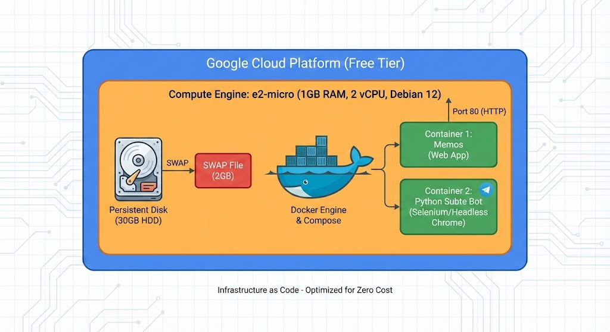
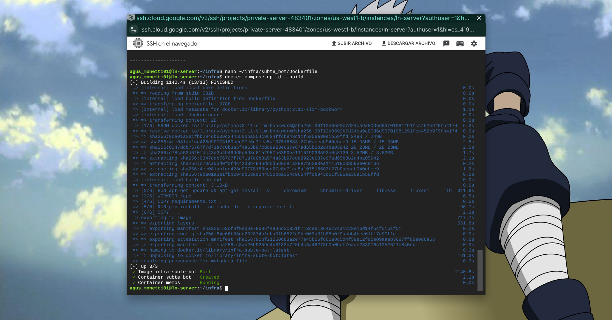
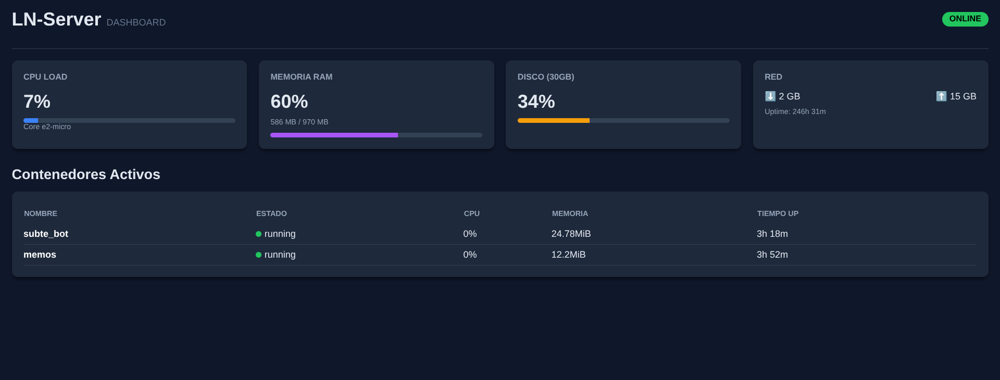

# ☁️ Infraestructura GCP Free Tier

## 🎯 Idea

El objetivo era desplegar un entorno de servidor propio en la nube para alojar proyectos personales, con una restricción estricta: **mantenerse 100% dentro de la Capa Gratuita (Free Tier) de Google Cloud Platform.**

El reto técnico principal fue ejecutar un **bot de Python que utiliza Selenium (Chromium Headless)**. Chromium es conocido por su alto consumo de memoria, y la instancia gratuita de GCP (`e2-micro`) solo ofrece **1 GB de RAM**, lo cual es insuficiente para esta tarea por defecto.

## Resolución

Se diseñó una arquitectura híbrida (Docker + Native Node.js) sobre una máquina virtual Linux altamente optimizada.

### Componentes Clave

| Componente | Elección Tecnológica | Justificación |
| :--- | :--- | :--- |
| **Cloud Provider** | GCP Compute Engine | Uso de la instancia `e2-micro` elegible para el Free Tier en `us-central1`. |
| **OS** | Debian 12 (Bookworm) | Menor consumo de recursos base comparado con Ubuntu. |
| **Orquestación** | Docker & PM2 | Docker para aislar aplicaciones y PM2 para servicios de sistema (Dashboard). |
| **Almacenamiento** | Persistent Disk (30GB) | Maximización del almacenamiento gratuito permitido. |
| **Seguridad** | VPC Firewall + SSH Tunnel | Puertos cerrados por defecto. El acceso al monitoreo es exclusivo vía túnel encriptado. |

## Optimizaciones

Para hacer viable este entorno con recursos tan limitados, se aplicaron técnicas de ingeniería de sistemas:

### 1. Gestión de Memoria
Con 1GB de RAM, el proceso de construcción de la imagen de Docker con Chromium fallaba por *Out Of Memory (OOM)*.

* **Solución:** Se implementó un archivo de intercambio (**Swap File**) de **2 GB** en el disco persistente.
* **Ajuste:** Se configuró `vm.swappiness=10` en el kernel para priorizar el uso de la RAM real y usar el disco solo cuando sea absolutamente necesario, evitando la degradación excesiva del rendimiento.

## Servicios Desplegados

Se utiliza un enfoque mixto para maximizar la eficiencia:

* **Servicio A: Landing Page (Portfolio)**
    * **Stack:** React 19 + Vite + TailwindCSS.
    * **Despliegue:** Estrategia **Docker Multi-stage**. Se utiliza una imagen de Node.js temporal para compilar el proyecto (aprovechando el Swap) y una imagen final de **Nginx Alpine** para servir los estáticos con mínimo consumo de RAM (<10MB).
    * **Red:** Expuesto en el **puerto 80** asociado al dominio `is-a.dev`.

* **Servicio B: Memos**
    * [Memos](https://github.com/usememos/memos): Alternativa open-source a Notion, ligera y potente.
    * Expuesto al **puerto 8080** (migrado para liberar el puerto principal).
    * Datos persistentes en volumen de Docker.

* **Servicio C: Subte Alerta Bot**
    * Bot de Python que monitorea el estado del subte de Buenos Aires vía web scraping (Selenium) y notifica por Telegram.
    * Se ejecuta en segundo plano (headless) sin exponer puertos.
    * **Optimización de Logs:** Se configuró la rotación de logs de Docker (`max-size: "10m"`, `max-file: "3"`) para evitar que la salida de Selenium llene el disco de 30GB con el tiempo.

* **Servicio D: Web de Monitoreo**
    * **Stack:** Node.js + Express.
    * **Estrategia:** A diferencia de los otros servicios, este agente corre sin Docker gestionado por **PM2**.
    * **Motivo:** Evitar el *overhead* de memoria de un contenedor adicional y facilitar la lectura directa de métricas del Kernel y del socket de Docker.
## Resultados

El despliegue fue exitoso. El servidor opera 24/7 de manera estable, manejando la carga de trabajo de compilación de Selenium gracias a la gestión de memoria virtual.

**Evidencia: Proceso de construcción y despliegue exitoso (Tiempo de build: +19 minutos)**

**Dashboard de Monitoreo**: Se desarrolló e implementó un dashboard para visualizar en tiempo real el consumo de recursos (CPU, RAM, Disco) y el estado de los contenedores.

> **Nota:** Este dashboard no está expuesto a internet. Se accede únicamente mediante un **Túnel SSH**, garantizando que la infraestructura permanezca segura.
---
*Este repositorio documenta la infraestructura. El código fuente de los servicios se mantiene en repositorios privados.*
